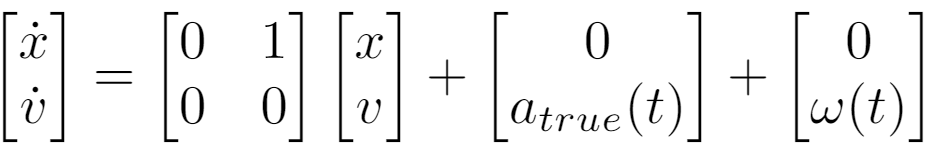
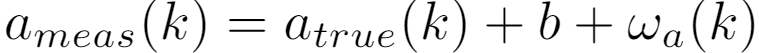
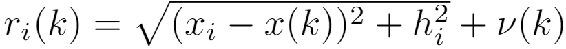
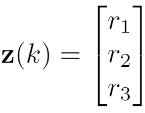

# Kalman-Filter-Example

This program is based on a simple vehicle tracking problem in  x direction where its postion and velocity are to be estimated through kalman filter. This makes it a two dimention estimation and as a prerequisite, basic knowlwdge in linear algebra, probability and statiscs will be sufficient to understand EKF.

### Problem Description

Consider a truck moving in 1-Dimensional space. The dynamic model is: 

where  **x**  and  **v**  are the position and velocity along the x axis.  **atrue(t)**  is the true acceleration at time  **t**  and  **ω(t)**  is the process noise. Accelerometer measurement model:

**ameas(k)**  is the measured acceleration, **b** is a constant bias in the accelerometer and **ωa(k)** is the zero mean white noise in the acceleration measurement. Range of the truck is measured using three becons, position of which are known. The range measurement model is:

Here,  **ri**  is the range of the truck from the  ith  bacon,  **xi**  and  **hi**  are x co-ordinate and height of the  ith  becon respectively.

The Task are:

1. Simulate the motion of the truck using the vector ordinary differential equation . Here, simulation means you need to generate a sequence of  **X**  vector in every 1 second for 300 seconds. During the first 100 seconds, the actual acceleration of the truck linearly increases from 0 to 0.05 m/s2  and remains constant for next 100 seconds and then linearly decreases to 0 by the next 100 seconds. The process noise  **ω(t)** standard deviation is 0.5 m/s2 . This sequence of  **X**  will be considered as the true state vector.
2. Generate corresponding acceleration measurement. Accelerometer bias is 0.01 m/s2  and accelerometer noise standard deviation is 0.001 m/s2
3. Generate three range observations  **ri(k)**  corresponding to each of  **X** vector generated in task 1 for each known bacon. The location of these beacons are at -1000m, 3000m and 4000m from the initial position of the truck and the height of each bacon is 500m. The standard deviation for the range is 1 m. Note that, at any given time your measurement vector will be: 
 
 

4. Develop Kalman Filter prediction and update functions.
5. Assuming that you only know the sequence of  **z(k)**  and  **ameas(k)**  for 300 seconds at 1 Hz rate, use the Kalman Filter prediction and update functions to estimate **X=[x v]T** corresponding to each **z(k)**.

### Resources

Visit https://www.kalmanfilter.net/default.aspx  to understand Kalman filter step by step. To understand derivation look at **IntroductionToEstimationForNavigation.pdf** inside docs folder.
